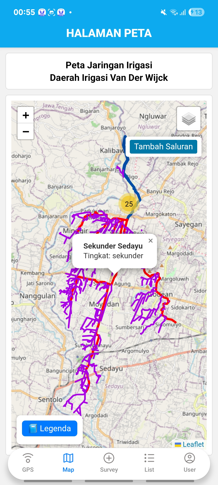

# 🛰️ AIRIS (Aplikasi Pemetaan dan Inventarisasi Jaringan Irigasi Berbasis Mobile GIS)

**AIRIS** adalah aplikasi **Mobile GIS** berbasis **React Native** yang dirancang untuk memetakan jaringan irigasi secara real-time dan akurat. Aplikasi ini terintegrasi dengan perangkat **GNSS Low Cost** dan dikembangkan sebagai bagian dari Proyek Akhir Program Studi Sarjana Terapan Sistem Informasi Geografis Universitas Gadjah Mada.

---

## 📌 Fitur Utama

- 🔗 Koneksi Bluetooth dengan perangkat GNSS Low Cost
- 🗺️ Peta interaktif jaringan irigasi (primer, sekunder, tersier)
- 📝 Form survei digital untuk mencatat atribut bangunan irigasi
- 📷 Dokumentasi foto untuk setiap titik bangunan
- 🔄 Fitur tambah, lihat, dan edit data secara langsung dari lapangan
- 📡 Dukungan pengambilan data koordinat RTK dengan akurasi sentimeter

---

## ⚙️ Teknologi

| Komponen | Teknologi |
|----------|-----------|
| Framework | React Native |
| Bahasa Pemrograman | JavaScript |
| Basis Data | PostgreSQL + PostGIS |
| Pemetaan | LeafletJS |
| Perangkat GNSS | TGS EQ1 Receiver |
| API Test | Postman |
| UI/UX Design | Figma |
| Sistem Operasi | Android (min. versi 7.0) |

---

## 🧪 Uji Kelayakan

Aplikasi ini diuji dengan metode **usability testing** berdasarkan 4 aspek utama:

- 📚 Learnability
- 🔄 Flexibility
- ✅ Effectiveness
- 😊 Attitude

---

## 🌍 Lokasi Studi Kasus

> **Saluran Irigasi Van Der Wijck**, Kabupaten Sleman, DI Yogyakarta  
> Dikelola oleh BBWS Serayu Opak dan DPUPESDM DIY

---

## 🗃️ Struktur Database

### Tabel `bangunan_irigasi`

| Field | Tipe | Deskripsi |
|-------|------|-----------|
| gid | Integer (PK) | ID bangunan |
| nama | Varchar(50) | Nama/kode bangunan |
| jenis_bgn | Varchar(50) | Jenis bangunan |
| koor | Geometry(Point, 4326) | Lokasi spasial |
| tgl_survei | Date | Tanggal pemetaan |
| kondisi | Varchar(50) | Kondisi fisik |
| luas_oncoran | Numeric(10,2) | Luas sawah terairi |
| ... | ... | Lainnya |

### Tabel `saluran_irigasi`

| Field | Tipe | Deskripsi |
|-------|------|-----------|
| id | Integer (PK) | ID saluran |
| nama_saluran | Varchar(50) | Nama saluran |
| jenis_saluran | Varchar(50) | Primer/Sekunder/Tersier |
| id_parent | Integer (FK) | Relasi saluran induk |

---

## 🚀 Cara Menjalankan

1. Clone repositori ini:
   ```bash
   git clone https://github.com/RiniHSD/Airis-App.git
   cd Airis-App

2. Install semua dependensi:
   ```bash
   npm install

3. Jalankan aplikasi di emulator atau perangkat Android:
   ```bash
   npx react-native run-android

4. Jika error saat menjalankan aplikasi, coba untuk membersihkan cache terlebih dahulu
   ```bash
   cd android
   ./gradlew clean
   
5. Coba jalankan kembali aplikasi di emulator atau perangkat Android
   ```bash
   cd ../
   npx react-native run-android

6. Pastikan GNSS Low Cost menyala dan Bluetooth diaktifkan di perangkat.


## 👩‍💻 Developer
- Rini Husadiyah
- Program Studi Sarjana Terapan Sistem Informasi Geografis
- Departemen Teknologi Kebumian
- Sekolah Vokasi
- Universitas Gadjah Mada

## 📫 How to reach me
<a href="https://www.linkedin.com/in/rinihusadiyah/"></a>
<a href="https://mail.google.com/mail/u/rinihusadiyah@gmail.com/#inbox?compose=new"></a>

## Tangkapan Layar Aplikasi AIRIS
### Splashscreen, Login, dan Register
<p align="center">
  
  
  
</p>

### Koneksi GNSS
<p>Metode Pengukuran yaitu GNSS Geodetik dan Posisi Internal Hp</p>
<p align="center">
  
  
  
  
</p>

### Halaman Peta
<p>Lokasi titik bangunan irigasi hasil pengukuran</p>
<p align="center">
  
  
  
</p>

### Halaman Survey
<p>Fitur menambahkan data titik</p>
<p align="center">
  
  
  
</p>

### Halaman List
<p>Daftar bangunan irigasi beserta fitur lihat, edit, dan hapus</p>
<p align="center">
  
  
</p>

<p>Fitur lihat titik di peta dengan validasi topology rules</p>
<p align="center">
  
  
  
  
</p>

### Halaman Pengguna
<p align="center">
  
</p>